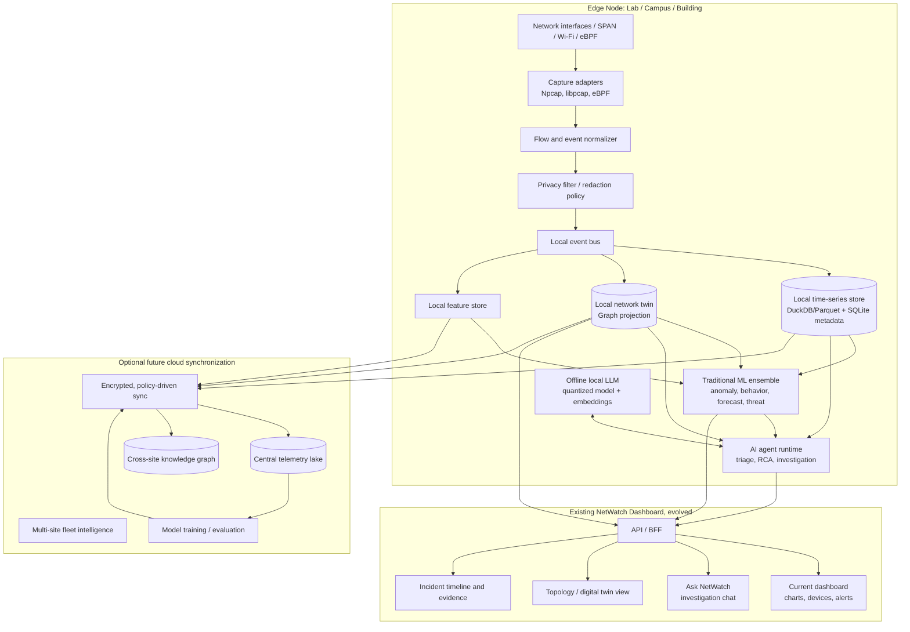
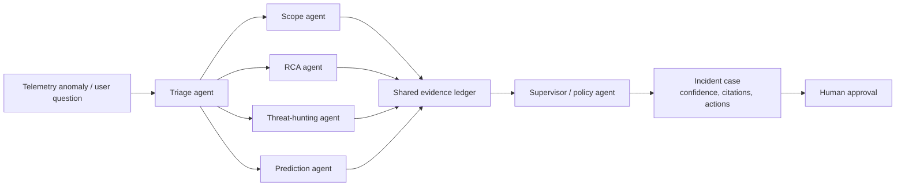
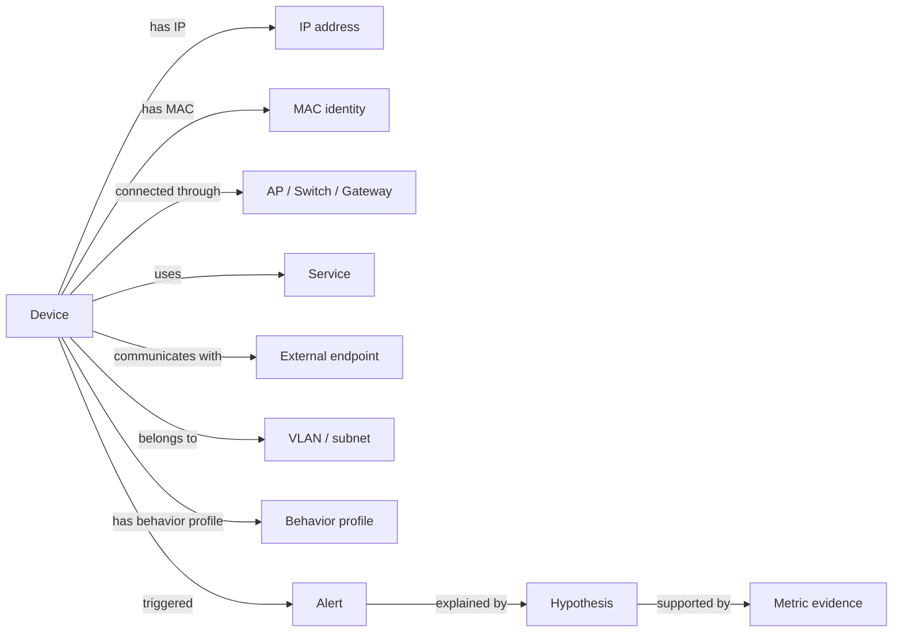

# NetWatch AI-First Network Intelligence Platform

## Product Vision

NetWatch should evolve into an **AI-first, edge-native Network Intelligence Platform**: a system that observes network behavior, builds a live digital twin of the network, predicts failures and threats, and lets users investigate incidents in natural language with evidence-backed explanations.

Packet capture and the existing dashboard remain important, but become sensors and visualizations for an intelligence layer rather than the product's primary differentiator.

Example operator workflow:

> Why did the Engineering Lab experience poor connectivity at 10:42 AM?

The system should answer using evidence:

- 43 devices moved to an overloaded access point.
- DHCP retry rate rose 8.1x above baseline.
- Two new unknown devices appeared shortly before degradation.
- Latency and retransmissions increased only for the affected VLAN.
- Confidence: 0.84. Recommended next check: inspect AP-03 channel utilization.

The LLM explains and orchestrates investigations; deterministic telemetry, graph analysis, and statistical/ML models supply the facts.

## Target Architecture

## Intelligence Features

| Feature | Value | Required data | Complexity | Expected accuracy | Local? | Best approach | Existing-repository integration |
|---|---|---|---|---|---|---|---|
| AI incident-triage agent | Turns many alerts into one prioritized incident with likely scope and cause. | Alerts, flow metrics, device state, topology, historical baselines. | Medium | 70-85% useful triage after tuning. | Yes | Traditional ML + LLM explanation. | Consume current alert, metrics, device, and SSE data. |
| Network digital twin | Maintains a live model of devices, interfaces, gateways, services, flows, and relationships. | MAC/IP/hostname/vendor, ARP/DHCP/DNS/mDNS, flows, interface data, optional SNMP. | High | 80-95% for observed links. | Yes | Graph algorithms; not primarily LLM. | Extend current device discovery and mode detection into graph events. |
| Knowledge graph | Enables change detection, impact analysis, and relationship-aware investigations. | Twin entities, event timelines, alerts, vulnerabilities, behavior profiles. | High | Deterministic for observed relationships. | Yes | Property graph + graph queries. | Add a graph projection fed by SQLite/current packet pipeline. |
| LLM investigations | Lets users ask natural questions and receive cited, structured evidence. | Retrieved metrics, graph facts, alerts, runbooks, documentation. | Medium | High usefulness; factual accuracy requires tool grounding. | Yes | Local LLM with retrieval and strict tool calls. | Add investigation APIs; dashboard gains chat and case views. |
| Predictive analytics | Forecasts bandwidth saturation, device overload, and likely outages. | Bandwidth, loss, retransmits, DNS/DHCP rates, device counts, interface health. | Medium | 70-90% for stable short-horizon capacity forecasts. | Yes | Time-series ML/statistics, not LLM. | Reuse bandwidth history and add richer periodic telemetry. |
| Root-cause analysis | Distinguishes symptoms from plausible causes. | Causal timeline, topology graph, correlated metrics, recent changes. | High | 60-80% ranked top-three cause with adequate telemetry. | Yes | Causal/graph reasoning + LLM narrative. | Build on alerts, mode events, health metrics, and twin data. |
| Device behavior learning | Learns normal behavior for each device and peer group. | Per-device flows/protocols/hourly activity/destinations/DNS. | High | 80-95% anomaly precision after warm-up for stable devices. | Yes | Clustering, embeddings, sequence models. | Expand current MAC-based device records into behavior profiles. |
| Threat detection | Identifies scans, beaconing, DNS tunneling signals, rogue devices, and lateral movement. | Flow metadata, DNS, protocol metadata, connection rate, graph, optional threat feeds. | High | 60-90%, varying by threat. | Yes | Rules + graph analytics + ML; LLM explains only. | Add detectors beside Isolation Forest and AlertEngine. |
| Explainable AI | Makes alerts defensible and builds operator trust. | Feature contributions, baselines, detector/rule evidence, graph paths. | Medium | Deterministic evidence quality. | Yes | Feature attribution, rules, graph paths; LLM summarizes. | Extend alert schema with evidence and confidence. |
| Natural-language querying | Makes monitoring accessible to non-experts. | API/tool schema, twin/telemetry retrieval, user context. | Medium | Strong with constrained tools and citations. | Yes | Local LLM function calling. | Wrap existing REST endpoints as safe read-only investigation tools. |
| Multi-agent investigation | Separates specialist tasks and produces a reviewable incident case. | Shared incident state and tool outputs. | High | Better coverage than one prompt; depends on guardrails. | Yes | Bounded agent workflow. | Current modules become tools behind a new service layer. |
| Edge/offline inference | Keeps sensitive telemetry local and works without internet. | Local models, feature store, cached runbooks. | Medium | Depends on local model quality. | Yes | Quantized local LLM + conventional ML. | Preserve the current local dashboard as baseline. |
| Future cloud synchronization | Enables multi-site comparisons and model improvement without mandatory cloud use. | Privacy-filtered aggregates, model metrics, selected incident artifacts. | High | N/A | Edge remains independent. | Federated/central training with encrypted sync. | Add an outbox/event journal rather than direct cloud coupling. |

## Multi-Agent Investigation Design

Recommended roles:

- **Triage agent:** groups related anomalies into an incident.
- **Scope agent:** identifies affected devices, subnets, services, and time window.
- **RCA agent:** evaluates ranked causal hypotheses using topology and temporal evidence.
- **Threat-hunting agent:** evaluates suspicious behavior against rules, peer baselines, and graph signals.
- **Forecast agent:** predicts saturation, device risk, and likely future anomalies.
- **Supervisor agent:** checks that every claim has supporting telemetry and assigns confidence.
- **Human operator:** approves any remediation. The system recommends actions; it does not change network configuration automatically.

## Digital Twin Model

Core entities:

- Device, identity, interface, subnet/VLAN, gateway, access point/switch.
- Service, protocol, flow, DNS name, and external endpoint.
- Behavior profile, baseline, anomaly, incident, hypothesis, and evidence.
- Optional: vulnerability, asset owner, location, policy, and student/lab role.

## Offline and Edge Strategy

- Preserve Scapy/Npcap capture initially; add eBPF on Linux as the high-performance future adapter.
- Convert packet-level data into privacy-filtered flow and event records quickly.
- Store short-retention raw data locally; retain aggregates, features, incidents, and graph changes longer.
- Use a compact local LLM for explanation and query orchestration.
- Use local embeddings for runbooks, campus policies, and network documentation.
- Keep traditional ML models local because they are inexpensive, explainable, and reliable offline.
- Synchronize only encrypted, policy-approved aggregates and incident summaries when cloud connectivity is enabled.

The LLM must never be treated as the telemetry source of truth. It must query validated tools and return citations to event IDs, graph paths, metrics, and time windows.

## Gap Analysis

| Capability | Current NetWatch | AI-first target |
|---|---|---|
| Capture | Scapy packet capture and mode-aware filtering. | Multi-adapter edge capture, flow normalization, optional eBPF. |
| Data model | SQLite packet/device/alert tables. | Event journal, time-series store, feature store, digital twin, knowledge graph. |
| Analytics | Thresholds and Isolation Forest. | Detector ensemble, per-device learning, forecasting, causal RCA, threat analytics. |
| AI | Single local anomaly model. | Offline LLM plus bounded investigation agents and explainability. |
| Topology | Device discovery and mode context. | Continuously updated network digital twin with graph queries. |
| Dashboard | Charts, device list, alerts, SSE. | Keep it; add twin view, incident cases, evidence timeline, natural-language chat. |
| Deployment | Single-process monolith and local SQLite. | Edge-node first; event-driven internal services; optional cloud sync. |
| Multi-site | None. | Offline-first federation and encrypted synchronization. |
| Trust | Alert messages and raw metrics. | Evidence ledger, confidence score, feature attribution, human approval. |

## Migration Roadmap

### Phase 1 — Intelligence-ready telemetry

Keep packet capture and the dashboard. Add normalized network events, richer flow summaries, a stable incident/evidence schema, and a local event journal.

**Outcome:** every packet-derived observation can become a timestamped, queryable fact.

### Phase 2 — Digital twin and knowledge graph

Create graph entities from device discovery, DNS/mDNS, ARP, interface, gateway, and flow data. Add a topology/twin screen to the dashboard.

**Outcome:** NetWatch understands relationships, not merely rows of traffic.

### Phase 3 — Device behavior intelligence

Build per-device baselines and peer groups. Add behavior scores for protocol mix, connection rates, destination novelty, time-of-day patterns, and traffic volume.

**Outcome:** alerts become “unusual for this device” rather than “above a universal threshold.”

### Phase 4 — Predictive and root-cause analytics

Add short-horizon bandwidth forecasting, degradation prediction, correlation analysis, and ranked root-cause hypotheses.

**Outcome:** the platform predicts and explains, not just detects.

### Phase 5 — Local LLM investigations

Add a local LLM with restricted tools for graph, metrics, alert, and incident retrieval. Require every response to show evidence and confidence.

**Outcome:** operators can investigate with natural language while retaining offline privacy.

### Phase 6 — Multi-agent incident cases

Introduce the triage, scope, RCA, threat, forecast, and supervisor workflow. Store each investigation as a replayable case.

**Outcome:** auditable AI-assisted incident response.

### Phase 7 — Optional cloud synchronization

Add encrypted outbox-based synchronization for aggregates, model metrics, and approved incident artifacts. Keep all essential functionality offline.

**Outcome:** a campus can compare sites without turning NetWatch into a cloud-dependent system.

## Suggested 16-Week Final-Year Sprint Plan

| Sprint | Focus | Demonstrable result |
|---|---|---|
| 1-2 | Telemetry event model and evidence schema | Current capture produces normalized flow/event records. |
| 3-4 | Digital twin MVP | Live topology graph with devices, gateway, protocols, and relationships. |
| 5-6 | Behavior learning | Per-device baseline and “why unusual?” evidence panel. |
| 7-8 | Threat analytics | Rogue-device, scan, beaconing, and DNS anomaly demonstrations. |
| 9-10 | Predictive analytics | Bandwidth saturation forecast and early-warning dashboard card. |
| 11-12 | Root-cause engine | Ranked incident hypotheses with topology-aware blast radius. |
| 13-14 | Offline LLM investigation | “Ask NetWatch” with cited metrics and graph evidence. |
| 15 | Multi-agent incident workflow | Triage-to-case workflow with confidence and human approval. |
| 16 | Evaluation and presentation | Accuracy, latency, privacy, and comparative study. |

The strongest viable final-year MVP is:

1. Digital twin.
2. Device behavior learning.
3. Root-cause ranking.
4. Offline natural-language investigation.
5. Explainable evidence timeline.

## Research Contribution

> **An offline-first, explainable multi-agent network intelligence system that combines packet-derived telemetry, a live network digital twin, device behavior learning, and evidence-grounded LLM investigations.**

Potential evaluation questions:

- Does graph-aware RCA rank true causes better than threshold-only alerting?
- Does per-device behavior learning reduce false positives compared with global Isolation Forest detection?
- Can a local LLM generate useful investigations while remaining grounded in telemetry evidence?
- How much privacy and latency benefit does edge inference provide over cloud-only analysis?
- Can the platform maintain useful incident accuracy during temporary internet loss?

Measure:

- Anomaly precision/recall.
- Top-1 and top-3 RCA accuracy.
- False-positive reduction.
- Forecast error.
- Investigation grounding rate.
- Edge inference latency.
- Data retained locally versus synchronized externally.

## Differentiation from Existing Monitoring Tools

| Platform | Typical strength | NetWatch Intelligence differentiator |
|---|---|---|
| Zabbix | Infrastructure metrics, templates, alerting. | Learns device behavior from packet/flow telemetry and investigates incidents through a graph-aware AI workflow. |
| PRTG | Fast sensor-based monitoring and dashboards. | Provides an evolving digital twin, offline AI inference, and evidence-backed natural-language RCA. |
| Nagios | Plugin-based availability checks. | Moves beyond threshold/availability monitoring into behavioral learning, prediction, and incident intelligence. |
| Grafana | Visualization and observability presentation. | Uses the dashboard as an investigation surface backed by agents, graph reasoning, and packet-derived intelligence. |
| SolarWinds | Broad enterprise monitoring suite. | Offers a privacy-first, offline-capable, edge-native research platform with transparent explainability and no mandatory cloud dependency. |

The central differentiator is not an LLM chat box for network data. It is the combination of:

- Packet-level visibility.
- A continuously updated network digital twin.
- Per-device behavioral intelligence.
- Graph-aware root-cause analysis.
- Local/offline inference.
- Evidence-grounded multi-agent investigations.
- Explainable, human-approved recommendations.
